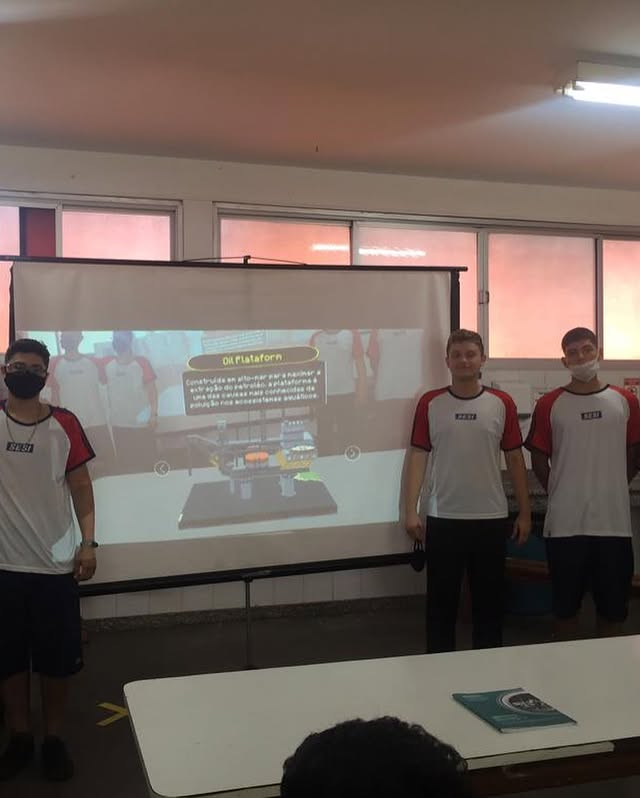

# AREvolution

Esse software foi criado em 2022 como uma atividade complementar interdisciplinar para as disciplinas de Inglês, Português, História e Geografia durante o 3º ano do ensino médio. Infelizmente, 
eu perdi acesso a vários arquivos do projeto, o aplicativo em si e a [board do Miro](https://miro.com/app/board/uXjVOAr5rsg=/?share_link_id=256926902696) ainda está disponível.

## Descrição

Essa atividade consistiu em uma feira onde foram apresentadas as quatro revoluções industriais. Como o nosso grupo ficou responsável pela 4ª Revolução Industrial, decidimos fazer um resumo das 
outras três em uma apresentação em realidade aumentada, concluindo a feira ao mesmo tempo em que demonstramos uma das características da 4ª R.I. Na apresentação mostramos três versões de uma cidade 
que sofreu diversas mudanças por conta das revoluções, como diminuição da mineração de carvão, extração de petróleo, utilização de energia eólica, etc.

	

## Como foi feito 

Em um primeiro momento, planejamos o layout das três versões das cidades com auxílio dos professores, definindo as características que mereciam mais destaques de cada R.I. 
Fizemos esse planejamento utilizando uma board Miro, que pode ser [acessado por aqui](https://miro.com/app/board/uXjVOAr5rsg=/?share_link_id=256926902696)).

	

Tendo isso definido, realizamos a construção das cidades no Minecraft, utilizando apenas blocos do jogo base (vanilla) para a construção. Isso se deu porque o Mineways, 
programa utilizado para exportar o mundo para modelo 3D, não suportava o uso de mods. O servidor utilizado na construção foi hospedado no Ploudos, um serviço gratuito que 
infelizmente foi encerrado. Tendo exportado os modelos 3D, a apresentação foi confeccionada na Unity. De início planejamos usar a ARFoundation para realização do projeto, 
mas como nenhum de nossos dispositivos apresentava suporte, decidimos utilizar a Vuforia no lugar.

|   			        **INTEGRANTE**              |     **CONTRIBUIÇÃO**    |
| :-------------------------------------------------------- | ----------------------: |
| **[Victor Hugo](https://github.com/KingOfCactus/)**       | Programação e Gestão    |
| **[Nicolas Oliveira](https://github.com/NicolasGoldner)** | Construção no Minecraft |
| **[Leonardo Diogo](https://github.com/LeonardoBuzelin)**  | Construção no Minecraft |
| **Lucas Ayolphi**    					    | Construção no Minecraft |
| **Will Emmanuel**    					    | Construção no Minecraft |
| **Caio Ferreira**    					    | Construção no Minecraft |

